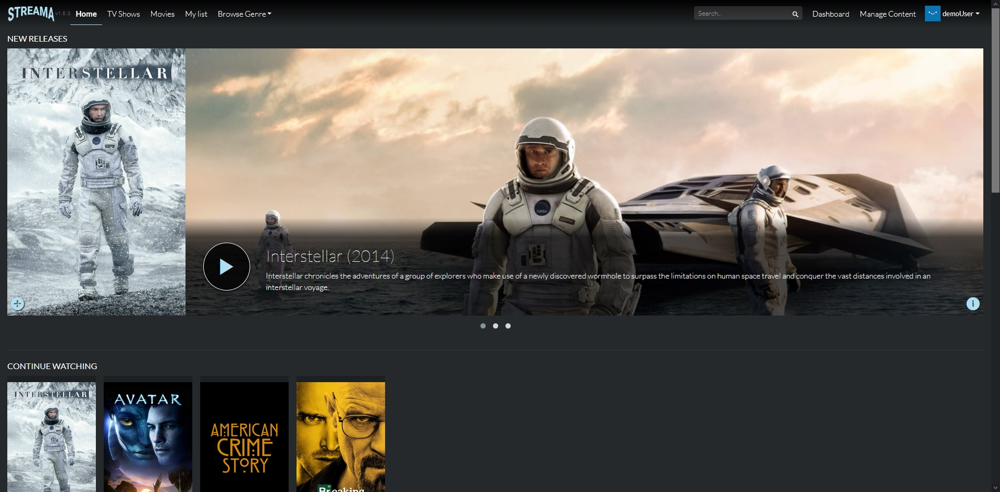

<!--
N.B.: This README was automatically generated by https://github.com/YunoHost/apps/tree/master/tools/README-generator
It shall NOT be edited by hand.
-->

# Streama for YunoHost

[](https://dash.yunohost.org/appci/app/streama)    
[](https://install-app.yunohost.org/?app=streama)

*[Lire ce readme en français.](./README_fr.md)*

> *This package allows you to install Streama quickly and simply on a YunoHost server.
If you don't have YunoHost, please consult [the guide](https://yunohost.org/#/install) to learn how to install it.*

## Overview

Self hosted streaming media server

**Shipped version:** 1.10.4~ynh1

**Demo:** https://streama.demo-version.net

## Screenshots




## Disclaimers / important information

## Disclaimers / important information

## Installation guide

> :warning: Streama must be installed in the root domain or subdomain.

Default upload directory is: `/home/yunohost.app/streama` (must be mentioned in *Settings* page or can be changed)
 
Default local video directory is: `/home/yunohost.app/streama/upload` (must be mentioned in *Settings* page or can be changed)

## Additional information

* After install:
 - **Username**: admin
 - **Password**: admin

This can be changed in settings.

### Convert video:
 
        $ convert_movies -ffmpeg 
        $ convert_movies -avidemux
        $ convert_movies -mencoder
        $ convert_movies -avconv
        
### Avidemux compilation:

        $ git clone https://github.com/mean00/avidemux2/
        $ cd avidemux2
        $ sudo apt-get install build-essential cmake \
        pkg-config yasm libsqlite3-dev libfontconfig1-dev \
        libfribidi-dev libxvdev libvdpau-dev libva-dev \
        libasound2-dev libpulse-dev libfdk-aac-dev \
        libpng-dev libmp3lame-dev libx264-dev \
        libxvidcore-dev libfaad-dev libfaac-dev libopus-dev \
        libvorbis-dev libogg-dev libdca-dev libx265-dev
        $ wget https://www.deb-multimedia.org/pool/main/a/aften/libaften0_0.0.8svn20100103-dmo2_amd64.deb
        $ wget https://www.deb-multimedia.org/pool/main/a/aften/libaften-dev_0.0.8svn20100103-dmo2_amd64.deb
        $ sudo dpkg -i libaften0_0.0.8svn20100103-dmo2_amd64.deb
        $ sudo dpkg -i libaften-dev_0.0.8svn20100103-dmo2_amd64.deb
        $ bash bootStrap.bash --deb --without-qt --with-cli

## Documentation and resources

* Official app website: https://streamaserver.org/
* Official admin documentation: https://docs.streama-project.com/
* Upstream app code repository: https://github.com/streamaserver/streama
* YunoHost documentation for this app: https://yunohost.org/app_streama
* Report a bug: https://github.com/YunoHost-Apps/streama_ynh/issues

## Developer info

Please send your pull request to the [testing branch](https://github.com/YunoHost-Apps/streama_ynh/tree/testing).

To try the testing branch, please proceed like that.
```
sudo yunohost app install https://github.com/YunoHost-Apps/streama_ynh/tree/testing --debug
or
sudo yunohost app upgrade streama -u https://github.com/YunoHost-Apps/streama_ynh/tree/testing --debug
```

**More info regarding app packaging:** https://yunohost.org/packaging_apps